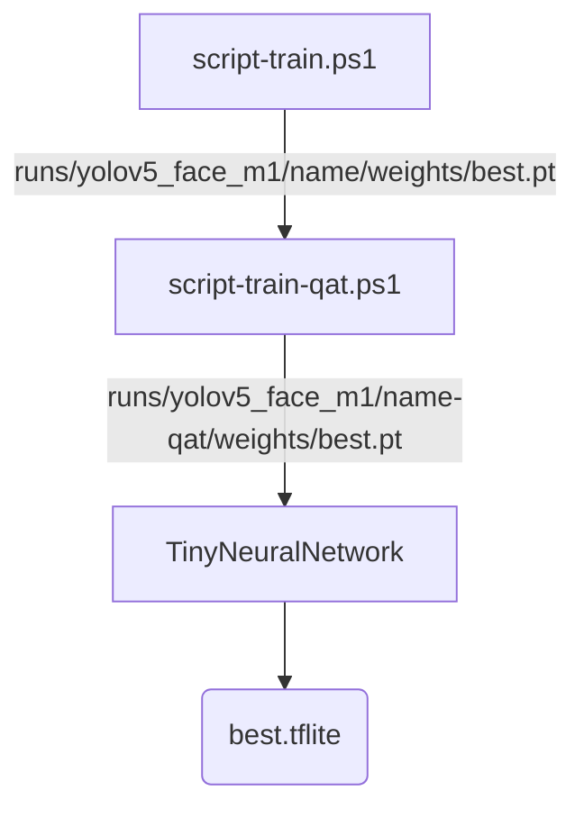

# Install

Clone repo and install [requirements.txt](http://192.168.215.101:3000/BillyHsueh/yolov5-altek-FaceDetection/src/branch/billy_branch/requirements.txt) in a [**Python>=3.8.0**](https://www.python.org/) environment, including [**PyTorch>=1.8**](https://pytorch.org/get-started/locally/).

```bash
git clone https://github.com/ultralytics/yolov5  # clone
cd yolov5
pip install -r requirements.txt  # install
```

# Train 
```shell
./script-train.ps1
```

script-train.ps1:
```powershell
...
$TrainingParams =  
@{ 
    model      = "yolov5altek" 
    dataset    = "face_NormalSize-origin-bg-winPC" 
    hyp_name   = "altek-lr0.01-no_mosaic-deg_45" 
    env_name   = "yolov5" 
    proj_name  = "yolov5_face_m1" 
    weights    = " " #pre-train model
    epochs     = 1000 
    imgsz      = 160 
    batch_size = 256 
    evolve     = 0 
    workers    = 8 
} 
```

# QAT 
```shell
./script-train-qat.ps1
```

script-train-qat.ps1:
```powershell
...
$TrainingParams =  
@{ 
    model      = "yolov5altek" 
    dataset    = "face_NormalSize-origin-bg-winPC" 
    hyp_name   = "altek-lr0.01-no_mosaic" 
    env_name   = "yolov5" 
    proj_name  = "yolov5_face_m1" 
    weights    = " " #pre-train model
    epochs     = 1000 
    imgsz      = 160 
    batch_size = 256 
    evolve     = 0 
    workers    = 8 
} 
```

# Detection
```shell
python detect.py 
```

detect.py:
```python
...
if __name__ == "__main__": 
    opt = parse_opt() 
    opt.weights = 'model.tflite' 
    opt.source =  'image.jpg'  
    opt.data = 'data.yaml' 
    opt.device ='cpu' 
    opt.imgsz = [160, 160] 
    opt.name = 'test_0.5' 
    opt.conf_thres = 0.5 
    opt.exist_ok = True 
    opt.save_txt = True # Save the output of the middle layer to txt
    opt.decode = True 
    opt.input_uint8 = True 
    opt.altek_tflite = True 
    main(opt) 
```

# Label format
label.txt: 
```
[cls_index] [bbox_center_x] [bbox_center_y] [bbox_w] [bbox_h]
```

# Training process


# The latest version of model.tflite
```
FaceDetection-20240305.tflite
```

# Path of dataset
```
/data/AIDATA/raw_data/2F-DATASET/face
```